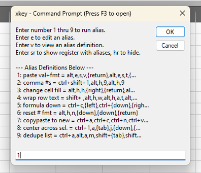

# xkey: reimagine your Excel hotkeys
Ever wish you had hotkeys for your hotkeys?

`xkey` is an experimental *proof of concept* to create *shorter* hotkey *aliases* for long keystroke sequences in Excel. It's a flexible alternative to customizing the quick access toolbar. Particularly useful if you're repeating multiple hotkeys back-to-back.
1) Work faster
2) Get started in 5 minutes
3) Inspired by experience and other great software tools

<picture align="left">
  
</picture>

Related: infinite monkey theorem

## How short is short?
Quickly access and edit long hotkey chains by pressing `F3`.

Examples:
|You want to...|Before|After|Keys Saved|
|---|---|:---:|:---:|
|Paste values & formats|`ALT E S V ENTER ALT E S T ENTER`|`F3 1 ENTER`|7|
|Comma # formatting|`CTRL+SHIFT+1 ALT H 9 ALT H 9`|`F3 2 ENTER`|6|
|Reformat cell|`ALT H H RIGHT ENTER ALT H F C ENTER CTRL+B` |`F3 3 ENTER`|9|
|Wrap header text|`SHIFT+SPACE ALT H W ALT H A C ALT H A T`|`F3 4 ENTER`|10|
|Copy a formula down|`CTRL+C LEFT CTRL+DOWN RIGHT CTRL+SHIFT+UP CTRL+V`|`F3 5 ENTER`|8|
|Reset # format|`ALT H N DOWN DOWN ENTER`|`F3 6 ENTER`|3|
|Copy & paste to a new book|`CTRL+A CTRL+C CTRL+N CTRL+V`|`F3 7 ENTER`|5|
|Center across selection|`CTRL+1 A TAB J DOWN ENTER`|`F3 8 ENTER`|4|
|Deduplicate a list|`CTRL+A ALT A M SHIFT+TAB SHIFT+TAB ENTER ENTER`|`F3 9 ENTER`|8|

## Tell me more...
### Leave your VBA at home
- Native hotkeys are all you need (maybe)
- Good for short-term hotkey combinations that aren't worth setting up a full macro for
- Get macro-like actions without a `.xlsm` file, personal macros, fiddling with the quick access toolbar, or memorizing shortcut icons

### 5-minute setup
- Download the `\core` folder. It's less than 150 lines of VBA so you can audit and edit
- Register the `.xlam` add-in file in Excel preferences
- It will automatically activate when you launch Excel
- Press `F3` to open the self-guided command prompt
- Follow the keystroke syntax of commands that come with the add-in. Lower-case key names separated by commas. Some special keys need to be placed in braces like `{left}` or `{return}`. See Microsoft's `SendKeys` documentation for more info
- OR, create an `.xlam` yourself after verifying the `.bas` files. Place in same folder as the `__register.xlsx` file

### Inspired by too much Excel
- Tired of pressing `ALT H` over and over
- Saving and changing personal macros on the quick access toolbar can be clunky
- Open up new ways to do things

### Learn from other power-user tools
- Borrows ideas from vim, a popular text-editing program
- Fully text-based interface, like original spreadsheets from the 1980s (Visicalc, Lotus). Text-based is fast
- Simple atomic functionality intended to be composable with other workflows

### Drive safely
- Speeding up native hotkeys can take you far *but...*
- This is only a proof of concept so far. No input validation, error handling, or other quality of life features
- Only works on Windows
- Relies on `SendKeys` functionality, which is controversial. `SendKeys` is sensitive and can fail
- Be careful when saving and running commands. You can't always `CTRL+Z`. Save often. Watch out for typos in your alias definitions

## Future features?
Could expand in a lot of ways.
- Ease-of-use, collaboration, and project lifecycle
- Better command prompt: Use a proper UserForm object in VBA...
- Execute commands using only two key presses (`F3 1`) instead of three (`F3 1 ENTER`)
- Recording keystrokes: instead of typing out key names, record an actual sequence of keystrokes like Excel's native macro recorder
- Multiple lists of aliases: create separate lists for different projects
- Bigger lists of alises: create aliases beyond just 1-9
- Executing multiple aliases: instead of running one at a time, enter a long string of aliases to run in sequence
- Telemetry: show how often commands are called. Easily execute the most popular ones. See a "ticker tape" of your most recent keystrokes
- Portability: easily share aliases with others or have teamwide profiles

